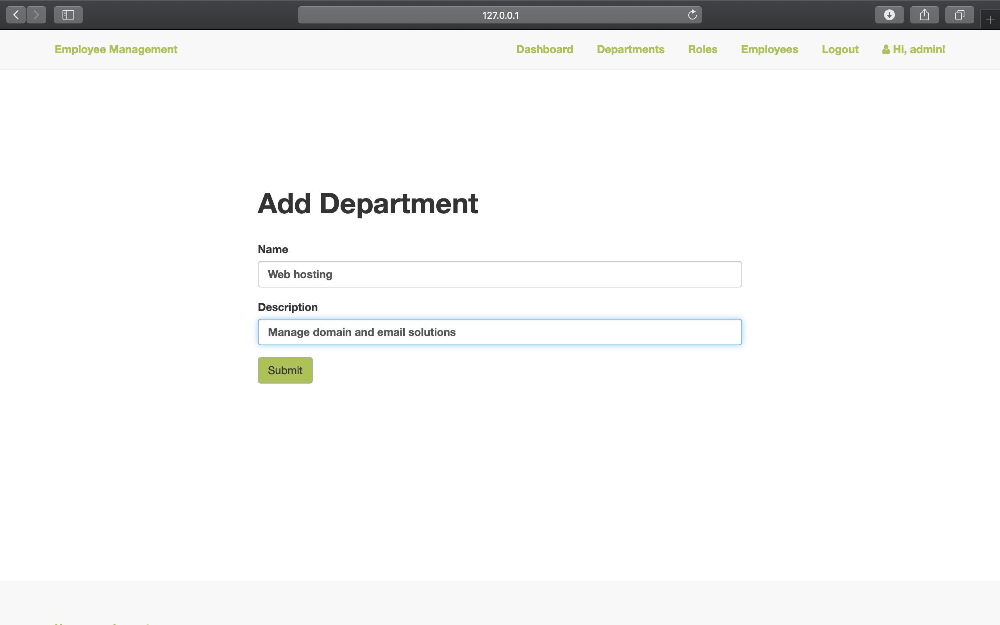
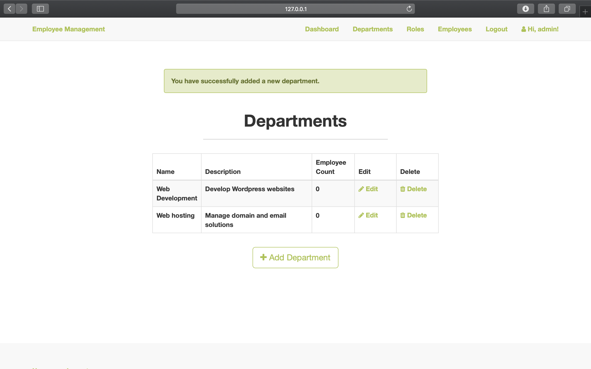
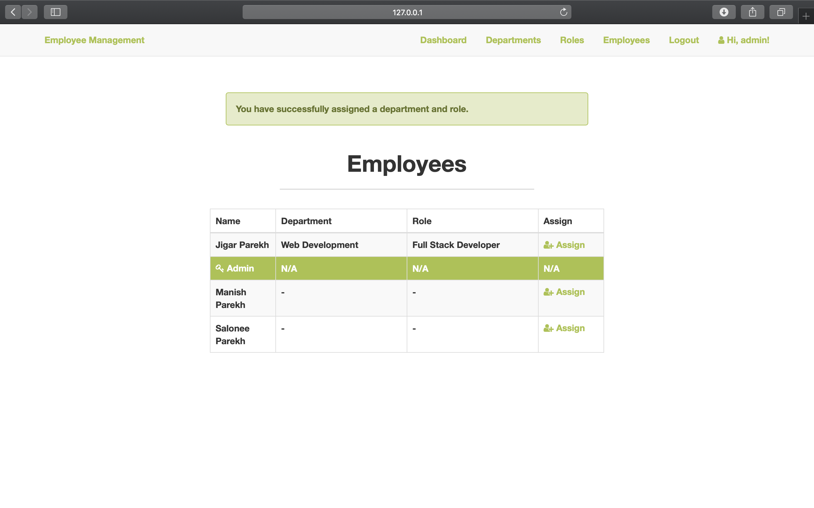

# Employee-Management-flask-webapp

This is developed on MacOS Catalina with Python version 2.7 using Anaconda.

## Installing Anaconda

Download [Anaconda](https://www.anaconda.com/distribution/#download-section)

### Create a Virtual Environment

	`$ conda create -n flaskenv python=2.7 anaconda`

### Activate the environment

	`$ conda activate flaskenv`

### To deactivate an active environment, use

	`$ conda deactivate`

## Install Flask

	`$ pip install Flask`
	
## Other dependencies

	`click==6.6`
Click is Command Line Interface Creation Kit which is used to add custom shell commands for the webapp.

	`itsdangerous==0.24`
ItsDangerous provides security when sending data using cryptographical signing.

	`jinja2==2.8`
Jinja2 is a templating language which is used to create HTML markup formats that are returned to the user upon an HTTP request. Moreover it is even used for Template Inheritance wherein we can save a basic layout in a base template and extend it to other pages.

	`MarkupSafe==0.23`
MarkupSafe is a string handling library that implements a text object that escapes characters so it is safe to use in HTML and XML.

	`Werkzeug==0.11.11`
Werkzeug is a utility library for WSGI(Web Server Gateway Interface) a protocol that ensures web apps and web servers can communicate effectively.
	

## Install [MySQL](https://dev.mysql.com/downloads/mysql/)

##### NOTE: Use Legacy Passowrd Encryption while setting up MySQL

## Install Flask-SQLAlchemy and MySQL-Python:

	`pip install flask-sqlalchemy mysql-python`

SQLAlchemy is an Object Relational Mapper (ORM), which means that it connects the objects of an application to tables in a relational database management system.

MYSQL-Python is a Python interface to MySQL. It will help us connect the MySQL database to the app.

## Creating MySQL Database

Login as the root user and enter your password

	`(flaskenv):$ mysql -u root -p`

### Creating user with username- em_admin and password- em2020

	`mysql> CREATE USER 'em_admin'@'localhost' IDENTIFIED BY 'em2020';
	Query OK, 0 rows affected (0.01 sec)`

### Creating database named- emp_db

	`mysql> CREATE DATABASE emp_db;`

### Granting access to our user

	`mysql> GRANT ALL PRIVILEGES ON emp_db . * TO 'em_admin'@'localhost';`
	
#### Make sure you set the FLASK_CONFIG and FLASK_APP environment variables before running the app

## Models- Employee, Department and Role

Model is a representation of a database table in code.

### Installing Flask-Login

For user management and handle logging in, logging out, and user sessions wherein the Employee model will inherit from Flask-Login's UserMixin class.

#### For user management and handle logging in, logging out, and user sessions.

	`$ pip install flask-login`

## Installing flask-migrate

Migrations allow us to manage changes we make to the models, and propagate these changes in the database.

	`$ pip install flask-migrate`

#### Create Migration Repository

	`$ flask db init`

This will create a "migrations" directory in the main directory

	`
	└── migrations
	    ├── README
	    ├── alembic.ini
	    ├── env.py
	    ├── script.py.mako
	    └── versions
	`
#### Creating first migration

	`$ flask db migrate`

#### Applying the migration

	`$ flask db upgrade`

### Tables will now be successfully created and can be checked by:

	`$ mysql -u root -p`

	`mysql> use em_db;`

	`mysql> show tables;
	+-----------------+
	| Tables_in_em_db |
	+-----------------+
	| alembic_version |
	| departments     |
	| employees       |
	| roles           |
	+-----------------+
	4 rows in set (0.00 sec)`
	
## Blueprints

Blueprints are used for organising the flask app into components, each with its own views and forms.

	`
	└── Employee-Management-Flask
	    ├── app
	    │   ├── __init__.py
	    │   ├── admin
	    │   │   ├── __init__.py
	    │   │   ├── forms.py
	    │   │   └── views.py
	    │   ├── auth
	    │   │   ├── __init__.py
	    │   │   ├── forms.py
	    │   │   └── views.py
	    │   ├── home
	    │   │   ├── __init__.py
	    │   │   └── views.py
	    │   ├── models.py
	    │   ├── static
	    │   └── templates
	    ├── config.py
	    ├── instance
	    │   └── config.py
	    ├── migrations
	    │   ├── README
	    │   ├── alembic.ini
	    │   ├── env.py
	    │   ├── script.py.mako
	    │   └── versions
	    │       └── a7bb5c73273d.py
	    ├── requirements.txt
	    └── run.py
	`
### Auth Blueprint- Creating registration and login forms 
	
	`pip install Flask-WTF`

Flask-WTF is used for creating registration and login forms.

	`pip install flask-bootstrap`

Flask-Bootstrap iis installed to use its wtf and utils library to create templates.	

### Flask Unit testing

	`pip install Flask-Testing`
	
Tests help ensure that the app is working as expected, without the need to manually test all of the app's functionality.

